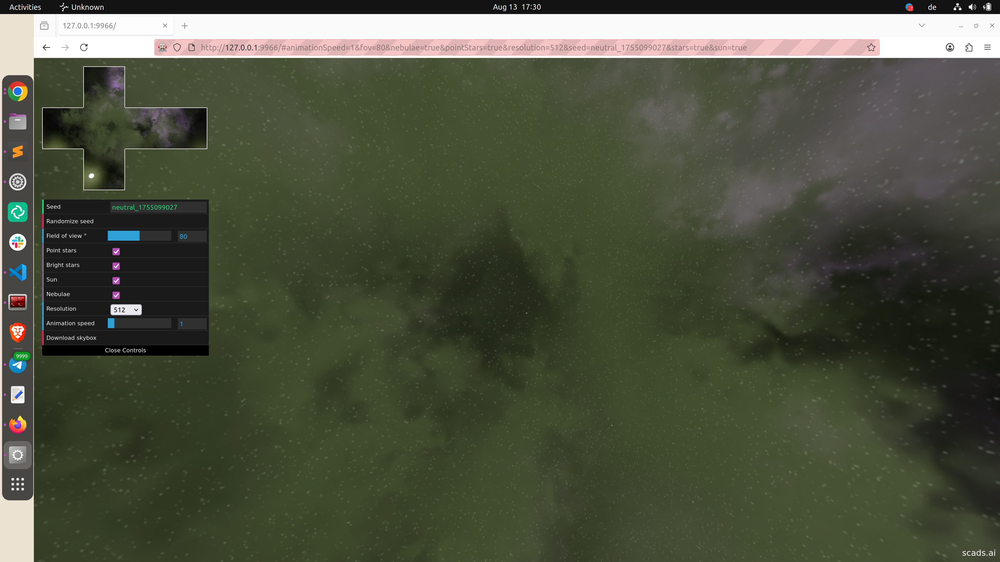
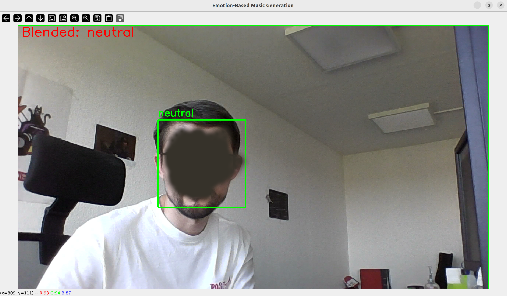

# emo_rec

  <!-- Place your logo image in the images/ folder and update the filename below -->
  

**This project is an immersive, real-time installation that bridges computer vision and generative art.**

**While WebGL renders a dynamic celestial night sky, a Python-based DeepFace backend monitors webcam input to analyze emotional states. 
These emotions act as a live conductor for MIDI-based AI music generated via Google Magenta that evolves in sync with the user’s feelings and the visual simulation.**

*Note: This is a fun demo project for the Long Night of Science, built in a limited time.*

## versions

- **v1.0** version with a  monophonic music samples and single face support

- **v2.0** Update: AI-Generative Emotion Engine 

  - AI-Driven Soundscapes: Seamlessly blends MIDI with randomized, real-time music generated by Google Magenta.

  - Multi-Face Orchestration: Improved performance now supports multiple faces—the more people detected, the more complex and layered the sound becomes.

  - Visual Feedback: A new red frame indicator signals the exact moment an emotion is successfully captured..

## visual

## how to run:

### simulation part:

`cd space-3d/src`

`npm start`

### face detection part: 

- open a new terminal 

- please create a venv e.g:

  - `python -m venv venv/env`  
  - `source venv/env/bin/activate`

  - `pip install -r requirements.txt`

**You are ready to run the inference part:**

- go to the root directory of the repo

- run one of the the scripts:

  - `python emo_inference_v1.py`  - 1.0 version with a  monophonic music samples

  - `python emo_inference_v2.py`  - 2.0 version with AI-generated (via [Magneta](https://github.com/magenta/magenta)) MIDI samples and improved performance (multiple faces support)

**You should see:**

python script will find the simulation ip that running on the backgroud. You should see an image from a webcam and separately webpage with a simulation, when there is a face detected you should see change in the simulation and music

# generation of AI music with a simple model

To generate your own model with [Magneta](https://github.com/magenta/magenta) please adapt `generation.py`

## to-do:

- change to normal API instead of seleniun
- work on the performance on small machines
